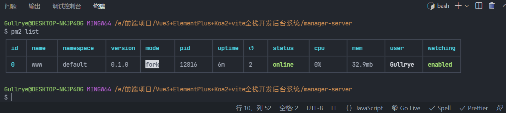
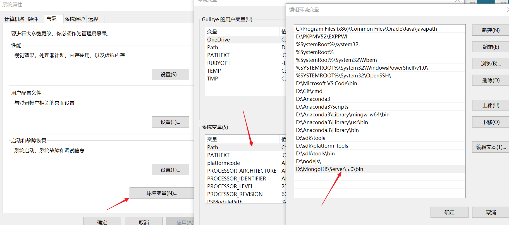
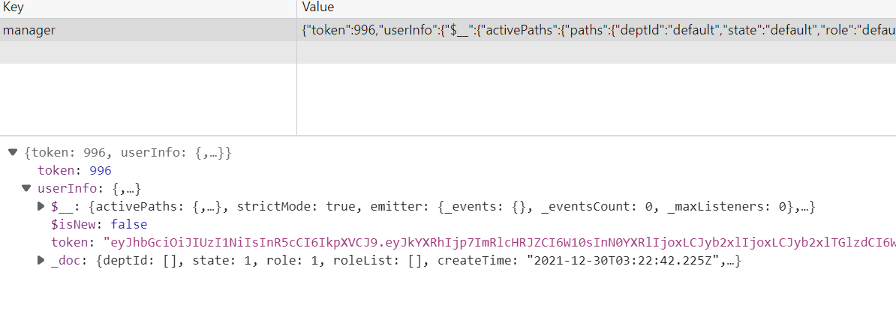

# 后台管理——简易前后端

## 前端

### 初始化

- 创建 vue3 + vite 项目 `yarn create vite manager-fe --template vue` (fe 即 frontend)
- 安装项目所需插件

```bash
# 安装项目生产依赖
yarn add vue-router@next vuex@next element-plus axios -S
# 安装项目开发依赖
yarn add sass -D
```

- `"element-plus": "^1.2.0-beta.6"` 个人配置的按需引入，使用最新[官方文档的自动导入](https://element-plus.gitee.io/zh-CN/guide/quickstart.html#%E8%87%AA%E5%8A%A8%E5%AF%BC%E5%85%A5-%E6%8E%A8%E8%8D%90)，下载插件然后配置下，很快搞定，告别手动导入
- vite.config.js 文件下设置 server 选项，下边指定 host 和 port

```js
server: {
  host: 'localhost',
  port: 9011,
},
```

- 创建各目录
- 环境变量
  - vite 无法用 `process.env` 获取环境变量，要使用 `import.meta.env`
  - <https://cn.vitejs.dev/guide/env-and-mode.html>
- package.js 中设置 `"dev": "vite --mode dev"`
- 新建 .env.dev 文件，文件名表示「只在 dev 模式下加载」
  - 只有以 VITE\_ 为前缀的变量才会暴露给经过 vite 处理的代码
  - 写入 `NODE_ENV=development` 和 `VITE_Name=Gull`
- main.js 中写入 `console.log(import.meta.env)`
  - 重启 vite，可以看到控制台打印出的对象包含 `VITE_Name=Gull`
  - `"dev": "vite --mode dev"` 优先级大于 `NODE_ENV=development`，所以打印出 `MODE: "dev"`
- router/index.js
- vite import 组件时需要加上文件后缀.vue ！
- 环境配置 config/index.js
- fast mock 网站，mockjs 语法生成随机数据

### icon 自动导入设置

- 使用 [unplugin-icons](https://github.com/antfu/unplugin-icons#unplugin-icons)
- 安装 `yarn add -D unplugin-icons`
- 图标数据 `yarn add -D @iconify-json/ic`，即安装 `Google Material Icons` 图标集，[图标地址](https://icones.js.org/collection/ic?s=)
  - 使用例子 `<i-ic-outline-settings style="font-size: 2em; color: red" />`
- `yarn add -D @vue/compiler-sfc`

```js
// tsconfig.json
{
  "compilerOptions": {
    "types": [
      "unplugin-icons/types/vue",
    ]
  }
}
```

- 自动导入 `yarn add unplugin-vue-components -D`
- vite.config.js 配置

```js
import { defineConfig } from 'vite'
import vue from '@vitejs/plugin-vue'
import AutoImport from 'unplugin-auto-import/vite'
import Components from 'unplugin-vue-components/vite'
import { ElementPlusResolver } from 'unplugin-vue-components/resolvers'
import Icons from 'unplugin-icons/vite'
import IconsResolver from 'unplugin-icons/resolver'
import { resolve } from 'path'

export default defineConfig({
  plugins: [
    vue(),
    AutoImport({
      resolvers: [ElementPlusResolver()],
    }),
    Components({
      resolvers: [ElementPlusResolver(), IconsResolver()],
    }),
    Icons({
      // expiremental
      autoInstall: true,
      compiler: 'vue3',
    }),
  ],
})
```

### 其他

- 面包屑

  - router 中设置 meta，组件中通过 this.$route.matched 获取当前路由的 meta

- `menuType`：1 代表菜单，2 代表按钮

## 后端

### koa2

- 全局安装脚手架工具 `npm i -g koa-generator`
- 进入到项目文件夹目录，执行生成命令 `koa2 manager-server`
- 安装依赖 `yarn`
- 启动服务 `yarn start`，默认的访问地址 `localhost:3000`
- 使用 **pm2** 部署 Koa 项目并实现启动、关闭、自动重启(最好在 vscode 终端中操作，表格显示的更清除)
  - 全局安装 `npm install -g pm2`
  - 启动项目。进入项目目录，`pm2 start ./bin/www` 启动 koa2 项目
  - **pm2 自动重启 `pm2 start ./bin/www --watch`**
  - 列出 PM2 启动的所有的应用程序 `pm2 list`
  - 停止。`pm2 stop all` 或者 `pm2 stop 0`，0 为应用程序 id
- pm2 相关命令(www 是项目名)
  - pm2 list #查看所用已启动项目
  - pm2 start #启动
  - pm2 restart www #重启
  - pm2 stop www #停止
  - pm2 delete www #删除
    
- [log4js-node](https://www.npmjs.com/package/log4js)

### MongoDB

- `mongod --version` 查看版本
- 命名不生效时，需要先配置环境变量
  

### 其它

- 以下都在代码中有注释
- [log4js 官方文档](https://log4js-node.github.io/log4js-node)，左侧有目录表格，可点击！
- mongoose
- JWT (JSON Web Token)
  - `yarn add jsonwebtoken`，进行配置生成 token
  - koa-jwt 拦截 token
    - `yarn add koa-jwt`
    - 接口校验，若 token 失效，则接口不通？
  - 后端获取前端请求中携带的 authorization 中的 token，与生成的 token 进行比较
  - login 路由使用 `res.token = token` 不生效原因：res 内还有一个 _doc 属性，真实返回数据为 res._doc
  

